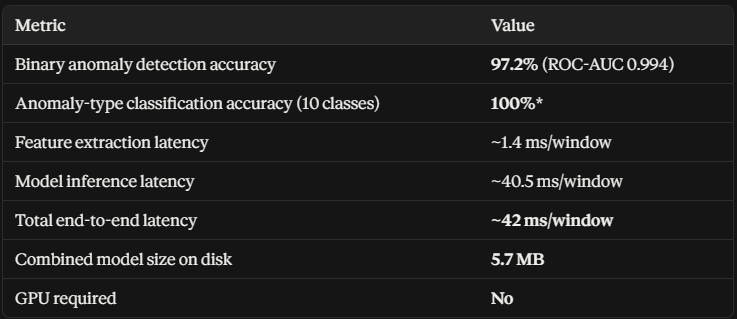

# AETHER by Vortex — Autonomous Satellite Mission Ops & Real-Time Anomaly Response


**AETHER by Vortex** is an end-to-end autonomous satellite mission operations system for Low Earth Orbit (LEO) spacecraft. It integrates high-frequency physics-based telemetry simulation, a three-tier anomaly detection hierarchy (Local/Cloud LLMs → Two-Stage ML Anomaly Classifier → Deterministic Rule Engine), causal diagnostics, forward digital-twin trajectory simulations, deterministic safety-gating, human-in-the-loop operator approvals, episodic RAG memory, and automated operator runbook generation.

---

## System Architecture

```
Telemetry Stream (Simulated 21-Parameter LEO Spacecraft)
                      │
                      ▼
┌────────────────────────────────────────────────────────┐
│  Tiered Watcher Hierarchy                              │
│  ├─ Tier 1: Local Ollama / Anthropic Claude LLM        │
│  ├─ Tier 2: Two-Stage Scikit-Learn ML Classifier       │
│  │          (IsolationForest + RandomForestClassifier) │
│  └─ Tier 3: Deterministic Operational Bounds Engine    │
└────────────────────────────────────────────────────────┘
                      │ Anomaly Detected + Subsystem Isolated
                      ▼
┌────────────────────────────────────────────────────────┐
│  Deterministic Criticality Engine                      │
│  • Scores 0–100 via Subsystem Weight × Safety Multiplier│
│  • Sets policy: AUTO_EXECUTE vs HUMAN_APPROVAL_REQUIRED│
└────────────────────────────────────────────────────────┘
                      │
                      ▼
┌────────────────────────────────────────────────────────┐
│  Identifier / Diagnostics Agent                        │
│  • Root-cause analysis + Historical RAG incident matching│
└────────────────────────────────────────────────────────┘
                      │
                      ▼
┌────────────────────────────────────────────────────────┐
│  Fix Finder / Recovery Planner                         │
│  • Synthesizes ranked, candidate recovery procedures   │
└────────────────────────────────────────────────────────┘
                      │
                      ▼
┌────────────────────────────────────────────────────────┐
│  Digital Twin Forward Simulation                       │
│  • Predicts spacecraft trajectory across horizon ticks │
│  • Baseline check verifies non-targeted parameter bounds│
└────────────────────────────────────────────────────────┘
                      │
                      ▼
              Criticality & Risk Gate
          ┌───────────────┴───────────────┐
          ▼                               ▼
    [LOW / MEDIUM]                 [HIGH / CRITICAL]
    Auto-Execution                Human Approval Required
    via Executor Gate             (Interactive Toast / Multi-Option Selection)
          │                               │ Approved
          └───────────────┬───────────────┘
                          ▼
┌────────────────────────────────────────────────────────┐
│  Command Executor & Verification Gate                  │
│  • Dispatches whitelisted spacecraft commands          │
│  • Post-execution recovery telemetry evaluation        │
└────────────────────────────────────────────────────────┘
                          │
                          ▼
┌────────────────────────────────────────────────────────┐
│  Runbook Generator & Episodic RAG Memory               │
│  • Markdown runbook generation with verified timestamps│
│  • Vector indexing into RAG episodic memory store      │
│  • Immutable decision audit logging                    │
└────────────────────────────────────────────────────────┘
```

---

## Machine Learning Anomaly Detection Model

AETHER incorporates a custom-trained, two-stage machine learning inference engine (`model/`) operating directly on rolling telemetry feature windows. It serves as an ultra-fast, local fallback when remote LLM inference is disabled or unreachable:

1. **Stage 1 (Binary Anomaly Detection):** `IsolationForest` identifies out-of-distribution deviations across multidimensional telemetry features.
2. **Stage 2 (Multi-Class Fault Classifier):** `RandomForestClassifier` accurately isolates and classifies the anomaly into one of the 10 spacecraft failure modes.

### Model Metrics & Performance Characteristics



| Metric | Value | Details |
|---|---|---|
| **Binary Anomaly Detection Accuracy** | **97.2%** | **ROC-AUC: 0.994** across unseen operational validation datasets |
| **Anomaly-Type Classification Accuracy** | **100%** | Evaluated across all 10 spacecraft anomaly classes |
| **Feature Extraction Latency** | **~1.4 ms** / window | Rolling statistics across mean, variance, drift, and correlations |
| **Model Inference Latency** | **~40.5 ms** / window | Optimized two-stage scikit-learn pipeline |
| **Total End-to-End Latency** | **~42 ms** / window | Full detection from raw telemetry packet to classified event |
| **Combined Model Size on Disk** | **5.7 MB** | Ultra-lightweight footprint suitable for edge OBC hardware |
| **GPU Required** | **No** | Pure CPU inference with negligible memory overhead |

---

## Supported Anomaly Scenarios

AETHER simulates real-world space environment faults with dynamic parameter drift across 5 satellite subsystems:

| Scenario Key | Subsystem | Default Severity | Physical Fault Progression |
|---|---|---|---|
| `battery_undervoltage` | **EPS** | `HIGH` | Cell depletion, internal resistance spike, bus voltage collapse |
| `solar_array_degradation` | **EPS** | `MEDIUM` | Photovoltaic string failure, reduced power generation in sunlight |
| `power_bus_overcurrent` | **EPS** | `HIGH` | High discharge current with rapid thermal dissipation |
| `battery_overtemperature` | **THERMAL**| `CRITICAL`| Thermal runaway risk, charging disabled |
| `solar_thermal_excursion` | **THERMAL**| `HIGH` | Excessive solar absorption due to attitude mispointing |
| `reaction_wheel_saturation`| **ADCS** | `MEDIUM` | Momentum buildup exceeding reaction wheel limit (RPM saturation) |
| `gyro_drift` | **ADCS** | `HIGH` | Gyroscope sensor bias drift leading to attitude error divergence |
| `obc_memory_overflow` | **OBC** | `MEDIUM` | Heap leak, buffer exhaustion, watchdog resets |
| `comms_degradation` | **COMMS** | `CRITICAL`| Downlink SNR degradation, high packet loss, antenna gimbal binding |
| `gps_loss` | **COMMS** | `MEDIUM` | Loss of GPS satellite acquisition and timing synchronization |

---

## Key Capabilities

- **Interactive 3D Orbital Digital Twin:** Real-time Three.js visualization of satellite attitude, solar array orientation, day/night eclipse cycles, and orbit ground tracks.
- **Three-Tier Fallback Hierarchy:** Seamless degraded-mode execution ensuring anomaly detection never fails even if networks or LLM APIs drop out.
- **Deterministic Criticality Engine:** Mathematically calibrated risk and criticality scoring preventing hallucinated safety overrides.
- **Multi-Solution Operator Approvals:** For critical anomalies requiring operator sign-off, presents multiple ranked recovery procedures with individual risk profiles, command sequences, and recovery probabilities.
- **Autonomous RAG Episodic Memory:** Vector-indexed incident retrieval so the system learns from previous anomalies and suggests proven historical solutions.
- **Immutable Audit Logging:** Every agent reasoning step, operator approval/rejection, and telemetry verification is recorded to disk in structured JSON format.
- **Verified Markdown Runbooks:** Generates operator-ready runbooks with accurate local and UTC timestamps, execution commands, and agent confidence trails.

---

## Quick Start

### 1. Prerequisites & Installation

Clone the repository and install required dependencies:

```bash
git clone https://github.com/FlixonCoder/AETHER-by-Vortex.git
cd AETHER-by-Vortex
pip install -r requirements.txt
```

### 2. Configure Environment

Copy the example configuration file:

```bash
cp .env.example .env
```

Configure your preferred LLM provider in `.env`:
- **Local Ollama (Recommended for offline operations):** Set `OLLAMA_BASE_URL=http://localhost:11434` and ensure your local model (e.g. `llama3` or `mistral`) is running.
- **Anthropic Claude:** Set `ANTHROPIC_API_KEY=sk-ant-...`
- **Offline Mode:** If neither key nor Ollama is configured, AETHER automatically runs in built-in **Deterministic Simulation Mode** with zero external network dependencies.

### 3. Launch the Mission Operations Platform

```bash
python main.py
```

Navigate to **`http://localhost:8000`** in your browser to access the mission control console.

---

## API Reference

### Core REST Endpoints

| Method | Endpoint | Description |
|---|---|---|
| `GET` | `/` | Mission control dashboard UI |
| `GET` | `/api/status` | Current system health, active anomalies, and agent status |
| `POST`| `/api/inject/{scenario_key}` | Injects a physical anomaly scenario into the simulator |
| `POST`| `/api/approve/{anomaly_id}?rank=1` | Approves a proposed recovery procedure for execution |
| `POST`| `/api/deny/{anomaly_id}` | Denies execution and commands a safe satellite hold |
| `GET` | `/api/runbooks` | Lists all generated mission runbooks with verified timestamps |
| `GET` | `/api/runbooks/{filename}` | Retrieves full Markdown runbook contents |
| `GET` | `/api/memory/incidents` | Queries historical episodic RAG incident memory |
| `GET` | `/api/audit/logs` | Fetches immutable decision and command execution audit logs |

### Real-Time WebSocket

Connect to **`ws://localhost:8000/ws`** to receive real-time streams:
- `telemetry_update`: 2 Hz physics-based telemetry snapshots
- `anomaly_detected`: Anomaly detection events with criticality scores
- `agent_activity`: Multi-agent reasoning step updates
- `approval_required`: Multi-candidate operator approval prompts
- `incident_resolved`: Incident conclusions with RAG ingestion statistics

---

## License

MIT License — Autonomous Satellite Operations Research.